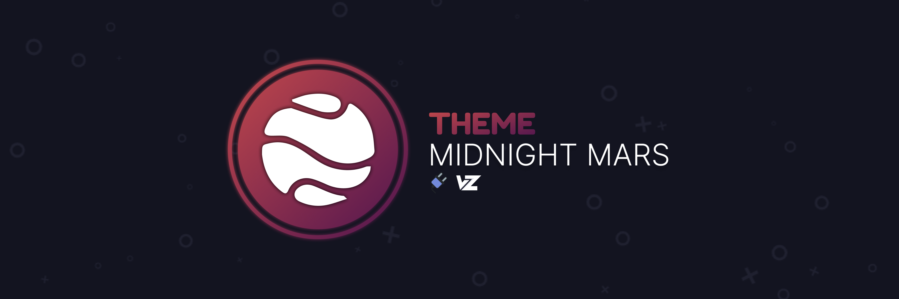
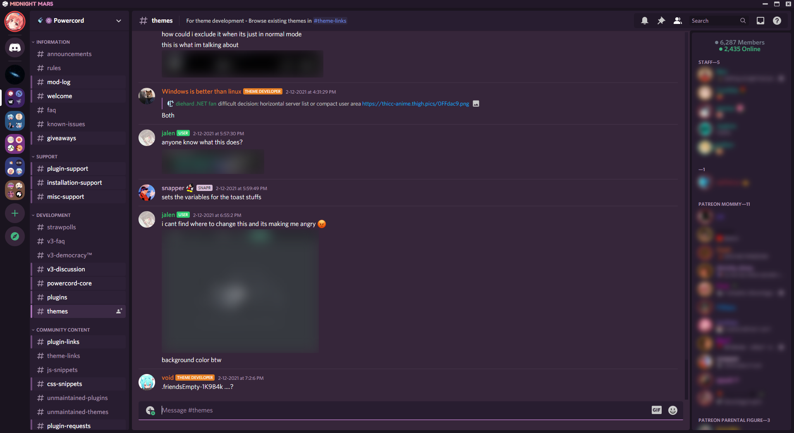

<p align="center">
  <a href="#">
  <a href="#">
  <a href="https://github.com/LuckFire/Midnight-Mars/stargazers"></a>
</p>

# 🪐Midnight Mars 
A simple, nice looking, deep purple theme inspired by **midnight** on **Mars**.



# Currently In-Dev
This theme is still currently in-dev. Some things still aren't themed and some things still need to be sorted out, full release should have 99% of things themed as well as more addons. To keep up to date and know what's changed, check out the CHANGELOG.md file!

# Installation
For **[Powercord](https://powercord.dev/)** or **[Vizality](https://vizality.com/)** installation, go to **Themes -> Open CMD / Powershell / Terminal / Gitbash**, and enter the following:
```
git clone https://github.com/LuckFire/Midnight-Mars
```

**Support for BetterDiscord and Web is coming soon:tm:! (hopefully release of v1.0.0)**

# Updating for Powercord
Powercords updater is currently broken, so in order to update the theme you will have to do it manually. To do it manually, go to **Themes -> Midnight-Mars -> Open CMD / Powershell / Terminal / Gitbash**, and enter the following:
```
git pull
```

# Customization (Powercord & Vizality Only)
Midnight Mars comes packed with a lot of cool looking addons, however some people may not like those. If you'd like to disable an addon, you can simply do that by going to `./src/addons/_addon-import.scss`, and commenting out / deleting the import for the addon that you dislike. 

# Credits
Thanks to [@Nyria's](https://github.com/NYRI4) [Comfy Theme](https://github.com/NYRI4/Comfy) for the idea of nice activity cards.

Thanks to [@Ben855](https://github.com/BenSegal855) for the theme name and theme description ideas <3

Thanks to Fahrenheight#0001 for allowing me to use the idea that separates the members list <3
