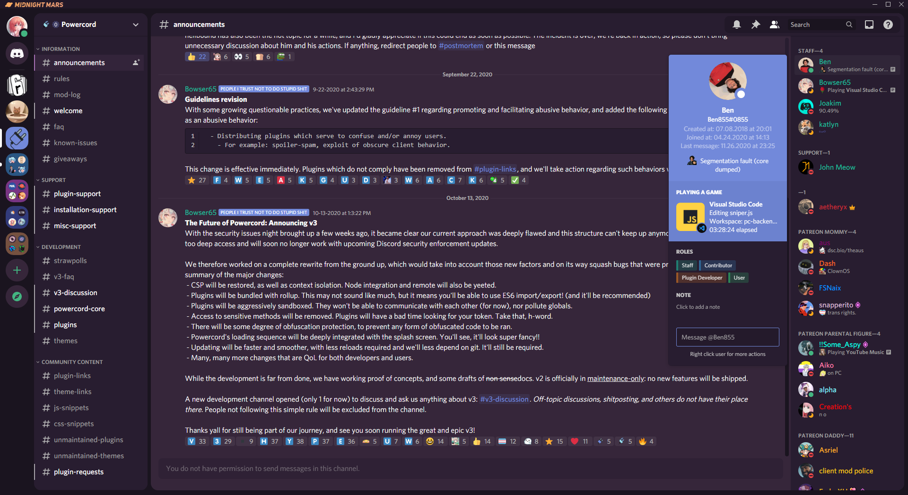

# 🪐Midnight Mars (dev)
A simple, deep purple theme inspired by midnight on Mars.



### NOTE: This theme is still kinda in-dev, I plan on changing/adding more stuff, also some things may be whacky so please make an issue request if you notice anything <3

# Installation & Updating
Let's get to the chase, you want this them, I know it, you know it. For installation, go to **Themes -> Open a CMD / Powershell / Terminal / Gitbash** in the folder, and enter the following:
```
git clone https://github.com/LuckFire/Midnight-Mars
```

Since Powercord's updater is currently broken, you have to update the theme manually. In order to do this, go to **Themes -> Midnight-Mars -> Open a CMD / Powershell / Terminal / Gitbash** in the folder, and enter the following:
```
git pull
```

# Customization
There are pleny of addons that come with this theme, as well as customization for it. If there's an addon that you don't like, you can simply go into the index.css file, and under where it says "Addons", find the addon that you dislike and either comment the line out or select and delete it!

If you'd like to submit an addon that's compatiable and you want everyone to use, make a pull request adding it to the addons folder!

### NOTE: Please do not submit CSS that isn't yours!

# Credits
Thanks to Ben#0855 for the theme name and theme description ideas <3

Thanks to Nyria#0001's Comfy Theme for the nice looking role pills idea :>
